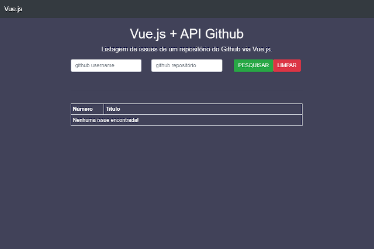

# vue-api-github

## Project setup
```
npm install
```

### Compiles and hot-reloads for development
```
npm run serve
```

### Compiles and minifies for production
```
npm run build
```

<hr>

Visualização: https://odeivdson.github.io/vue-api-github/


